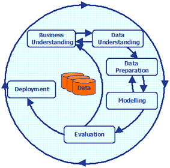

```{r setup, include=FALSE}
knitr::opts_chunk$set(echo = TRUE)
```

## Big Mart Sales
The Big Mart Sales Prediction was an online Data Science hackhathon on [Analytics Vidhya](https://datahack.analyticsvidhya.com/contest/black-friday/#data_dictionary). 

**Problem Statement**

*A retail company “ABC Private Limited” wants to understand the customer purchase behaviour* *(specifically, purchase amount) against various products of different categories. They have shared* *purchase summary of various customers for selected high volume products from last month.*
*The data set also contains customer demographics (age, gender, marital status, city_type,* *stay_in_current_city), product details (product_id and product category) and Total purchase_amount from* *last month.*
*Now, they want to build a model to predict the purchase amount of customer against various products* *which will help them to create personalized offer for customers against different products.*

In summary, we want to see if we can build a model which will predict amount spent by customers (Purchase Amount) on various products using their purchase history. To achieve this aim, we will follow the standard Datascience lifecyle (see figure 1)



## Data Understanding

**Data**
```{r, echo=FALSE, message=FALSE, warning=FALSE}
Variable <- c("User_ID", "Product_ID", "Gender", "Age", "Occupation", "City_Category", "Stay_In_Current_City_Years", "Marital_Status", "Product_Category_1", "Product_Category_2", "Product_Category_3", "Purchase")

Definition <- c("User ID", "Product ID", "Sex of User", "Age in bins", "Occupation (Masked", "Category of the City (A,B,C)", "Number of Years stay in current city", "Marital Status", "Product Category (Masked)", "Product may belong to other category also (Masked)", "Product may belong to other category also (Masked)", "Purchase Amount (Target Variable)")

a <- data.frame(Variable, Definition)
knitr::kable(a, caption = "Variables in dataset")
```


Two datasets were provided for the hack - the training and test datasets with 12 and 11 variables respectively. The "Purchase Amount" is the target variable and is hence missing from the test data. 


```{r, message=FALSE, warning=FALSE, include=FALSE}
library(tidyverse)
library(magrittr)
library(grid)
library(gridExtra)
```


```{r pressure, echo=FALSE}
train <- read.csv("data/train.csv", stringsAsFactors = FALSE)
test <- read.csv("data/test.csv", stringsAsFactors = FALSE)
```

**Data structure:**

```{r}
str(train)

str(test)
```
The training and test datasets are read into R and stored as train (550068 rows) and test (233599 rows). The summary statistics below show that for the training data, asides from Product Category 2 and Product Category 3, none of the variables have any missing values. The missing product categories is not unexpected as the data dictionary has explained that a product may belong to more than one category. Since Product category 1 has no NA, we may safely assume that the product belongs to category 1 if both categories 2 and 3 are NAs.


## Data Preparation

The Product_ID and USer_ID are interesting features. In many cases, these are usually discarded but in this case, I will keep them till I am sure they are not needed. They have been read in as characters and will be trandformed to factors. The Gender, City_category, Marital_Status, Product Categories and Occupation will also be transformed to factors.

In addition, the 

```{r}
train$User_ID <- as.factor(train$User_ID)
test$User_ID <- as.factor(test$User_ID)

train$Product_ID <- as.factor(train$Product_ID)
test$Product_ID <- as.factor(test$Product_ID)

train$Gender <- as.factor(train$Gender)
test$Gender <- as.factor(test$Gender)

train$City_Category <- as.factor(train$City_Category)
test$City_Category <- as.factor(test$City_Category)

train$Marital_Status <- as.factor(train$Marital_Status)
test$Marital_Status <- as.factor(test$Marital_Status)

train$Occupation <- as.factor(train$Occupation)
test$Occupation <- as.factor(test$Occupation)

train$Product_Category_1 <- as.factor(train$Product_Category_1)
test$Product_Category_1 <- as.factor(test$Product_Category_1)

train$Product_Category_2 <- as.factor(train$Product_Category_2)
test$Product_Category_2 <- as.factor(test$Product_Category_2)

train$Product_Category_3 <- as.factor(train$Product_Category_3)
test$Product_Category_3 <- as.factor(test$Product_Category_3)
```
**Summary statistics:**

```{r}
n_distinct(train$User_ID)
n_distinct(test$User_ID)
n_distinct(train$Product_ID)
n_distinct(test$Product_ID)

sum(is.na(train$User_ID))
sum(is.na(test$User_ID))
sum(is.na(train$Product_ID))
sum(is.na(test$Product_ID))
```

The number of unique users is evenly distributed in the train and test datasets (5891). In addition, there are 3631 and 3491 unique products in the train and test datasets respectively. There are no missing valuesfor users and products


```{r}
summary(train)
```

```{r}
summary(test)
```
**Define Hypotheses**

1. **Product:** The lower the cost of a product, the higher the number of purchases (count).

2. **Gender:** Women spend more on purchases than men

3. **Occupation:** Certain types of occupations will have higher purchases

4. **Age:** The older you are, the less you purchase (count and amount spent)

5. **Stay in current city:** The longer you stay in the city, the more purchases you make

6. **Product Category:** The category a product belongs to determines which Gender will have higher purchase (count)

7. **Product Category:** The category a product belongs to determines which Age band will have higher purchase (count)

### Exploratory Data Analysis
Before exploring further, I combined both the train and datasets in order to have a broader view of the dataset. However, I created a new variable "Source" which acts as label for the two sets and added a variable Purchase for the test set to allow for rbinding. NAs are assigned to this new variable in the test data.

```{r}
train$source <- "train"
test$source <- "test"
test$Purchase <- NA
```

```{r}
df <- rbind(train, test)
```

```{r}

summary(df)

```

```{r}
df %>% group_by(User_ID) %>%
  summarize(tot = n(), gend = first(Gender)) %>%
  arrange(desc(tot)) %>%
  head(10) %>%
  ggplot(aes(User_ID, tot, fill = gend)) + geom_bar(stat = "identity") +
  labs(x = "USER", y = "Total number of purchases", fill = "Gender") + 
  ggtitle("Number of purchases by each user showing their gender")

```


The plot above shows the top 10 users in terms of counts for the dataset. User 1001680 has the highest number of purchases (1468). We can also see that from the top 10 purchasers, there are 9 males and 1 female. To have a wider view, we will extend this to the top 20 in the next plot.


```{r}
df %>% group_by(User_ID) %>%
  summarize(tot = n(), gend = first(Gender)) %>%
  arrange(desc(tot)) %>%
  head(20) %>%
  ggplot(aes(User_ID, tot, fill = gend)) + geom_bar(alpha = 0.7, stat = "identity") +
  labs(x = "USER", y = "Total number of purchases", fill = "Gender") + 
  ggtitle("Number of purchases by each user showing their gender") +
  theme(axis.text.x = element_text(angle = 45, vjust = 1, hjust = 1))

```

Again, there is just one female user in the top 20. This is somewhat not accepting our second hypothesis of women spending more on shopping than men. To confirm this, let's look at the gender variable in terms of the number of purchases and also in terms of how much was spent on purchases

```{r}
df %>% ggplot(aes(Gender)) + geom_bar(alpha = 0.7)
```


In the first instance, from the dataset, there are more men than women. As this is a selected dataset, it will be difficult to make bold conclusions as we do not know how the data was selected. The next step is to look at the total amount spent by both men and females. Remember that only the "train" labeled data have purchase amount linked to them. Hence we will restrict our totals to this section only.

```{r}
p1 <- df %>% filter(source == "train") %>%
  group_by(Gender) %>%
  summarize(totalPurchases = sum(as.numeric(Purchase), na.rm = TRUE),
            count = n()) %>%
  ggplot() + geom_bar(fill = "blue", alpha = 0.7, aes(Gender, totalPurchases), stat = "identity")

p2 <- df %>% filter(source == "train") %>%
  group_by(Gender) %>%
  summarize(meanPurchases = mean(as.numeric(Purchase), na.rm = TRUE),
            count = n()) %>%
  ggplot() + geom_bar(fill = "blue", alpha = 0.7, aes(Gender, meanPurchases), stat = "identity")


grid.arrange(p1, p2, widths = c(0.5, 0.8))
```


In terms of the total purchases, there's a significant difference in the amount of money spent by males and females. This is most likely due to the large disparity in the number of men and women purchases in the data. A better way to look at purchases is to view it from an average point of view. In essence, how much does a person spend per visit. This is reflected in the second plot (right) showing the meanPurchases. This shows that although the men still lead in terms of purchases, the difference is not that much from the women. However, this means that our second hypothesis is not accepted.

**Occupation**
The variable "Occupation" defines the occupation of the customers. The real occupation is masked so we only know they are from group 0 to 20. We do not know what these numbers stand for except that they refer to different occupations. 

```{r}
df %>% group_by(Occupation) %>%
  summarize(Occ = n()) %>%
  ggplot(aes(Occupation, Occ)) + geom_bar(stat = "identity") + labs(x = "Occupation", y = "No. of Purchases", title = "Number of purchases made based on Occupation")
```


Occupation 4 has the highest number of purchases followed by Occupation 0 and then 7. This means that people with occupation 4 made the highest number of purchases at the store. On the other hand, people with Occupation 8 made the least number of purchases. How do these purchases compare with sales?

```{r}
df %>% filter(source == "train") %>%
  group_by(Occupation) %>%
  summarize(sumOcc = sum(Purchase), count = n()) %>%
  ggplot(aes(Occupation,sumOcc)) + geom_bar(fill = "blue", stat = "identity") +
  labs(x = "Occupation", y = "Amount Spent on Purchases", title = "Amount spent per Occupation")
```
There are no suprises in terms of the amount spent compared with the number of purchases. Occupation 4 still leads (666244484) followed by Occupation 0 (635406958). This is due to the large differences between the count of purchases. 

It is more insightful to compare based on average amount spent per purchase. This is shown in the next plot.

```{r}
df %>% filter(source == "train") %>%
  group_by(Occupation) %>%
  summarize(sumOcc = sum(Purchase), count = n(), mean1 = mean(Purchase)) %>%
  ggplot(aes(Occupation,mean1)) + geom_bar(fill = "blue", stat = "identity") +
  labs(x = "Occupation", y = "Average Amount Spent per Purchase", title = "Amount spent per Purchase by each Occupation")

```

This average aggregated plot highlights which occupation tends to spend more money per purchase. As can be seen, Occupation 12, 15 and 17's money spent per purchase is close to 10000 which are the top 3 in this category. However, when compared to total amount spent on all purchases over this time period, occupation 12 and 15 don't seem to do well even though they are willing to spend a lot of money on one purchase. It is therefore imperative for the company to spend time targeting this groups of customers.

The plot below shows the amount spent by gender per occupation. As mentioned earlier, seeing that men tend to spend more (per occupation) than women could be due to the fact that we have a very high difference between number of males compared to females in our data. That said, for some occupations like occupation 9, we see females spending more money than males. It is not surprising thatthere are a lot more women than men in this group as shown below.

```{r}
a1 <- df %>% filter(source == "train") %>%
  group_by(Occupation, Gender) %>%
  summarize(sumOcc = sum(Purchase), count = n()) %>%
  ggplot(aes(Occupation,sumOcc, fill = Gender)) + geom_bar(stat = "identity") +
  labs(x = "Occupation", y = "Amount Spent on Purchases", title = "Amount spent per Occupation")

a2 <- df %>% group_by(Occupation, Gender) %>%
  summarize(n = n()) %>%
  mutate(freq = round(n / sum(n), 2)) %>%
  ggplot(aes(Occupation, freq, fill = Gender)) + geom_bar(stat = "identity") +
  labs(x = "Occupation", y = "Percentage per Occupation", title = "Gender % per Occupation") +
  theme(axis.text.x = element_text(angle = 0, vjust = 0, hjust = 0))

grid.arrange(a1, a2, widths = c(0.5, 0.5))
```


Summarising this section, our hypothesis is allowed i.e. certain types of occupations spend more money than others. However, on single purchases, there is not much difference in terms of what occupations buy (note: this is dependent on the price range of items at this retail company)

**Age**

```{r}
df$Age <- as.factor(df$Age)
```

```{r}
df %>% filter(source == "train") %>%
  group_by(User_ID, Age) %>%
  summarize(Age1 = first(Age)) %>%
  ggplot(aes(Age1)) + geom_bar()
```

Of the 5891 users in the training dataset, those in the 26 to 35 years old range form the highest population followed by 36-45 and 18-25 respectively. The 0-17 for the least population.

```{r}
df %>% filter(source == "train") %>%
  ggplot(aes(Age, Purchase)) + geom_bar(stat = "identity")
```

```{r}
df %>% filter(source == "train") %>%
  group_by(Age) %>%
  summarize(count = n(), avGPurchase = mean(Purchase)) %>%
  ggplot(aes(Age, avGPurchase)) + geom_bar(stat = "identity")
```

Average purchases

*Products*
Which products are Popular?

```{r}

```